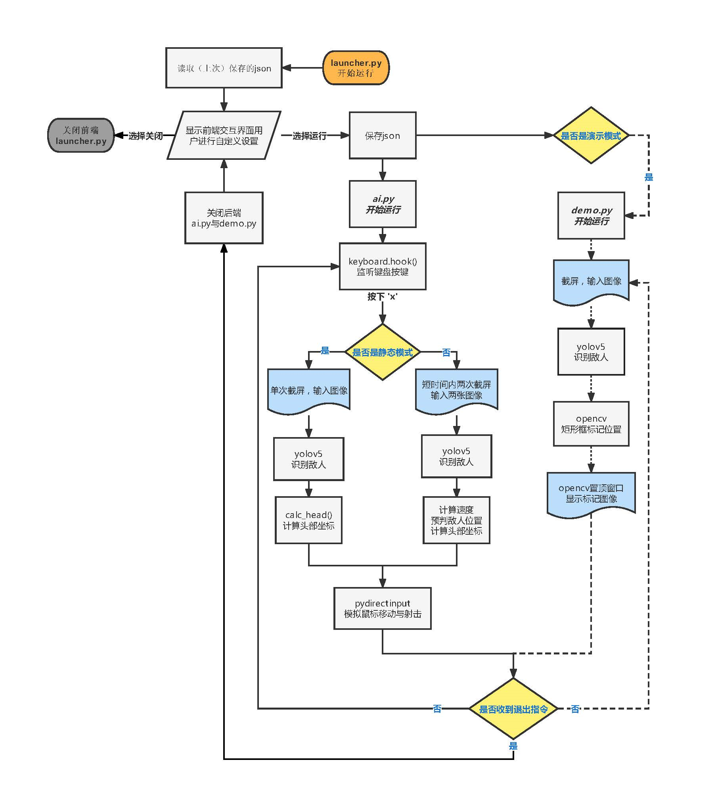
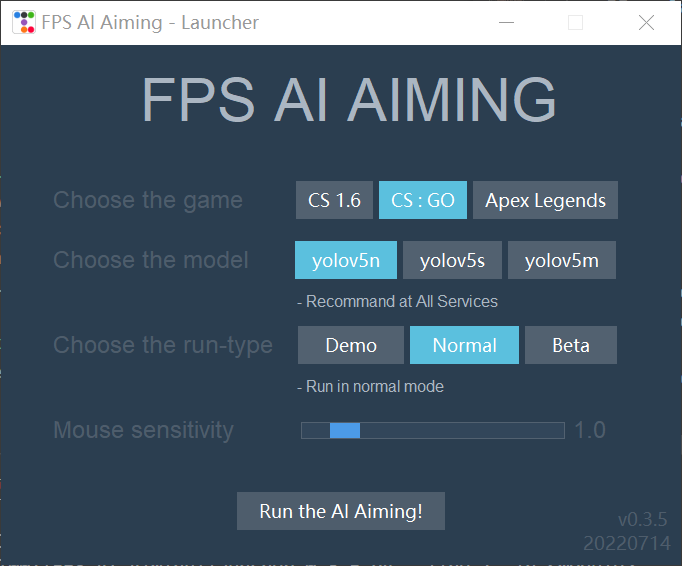
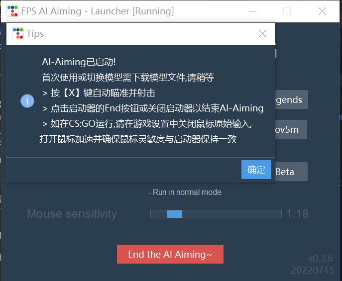
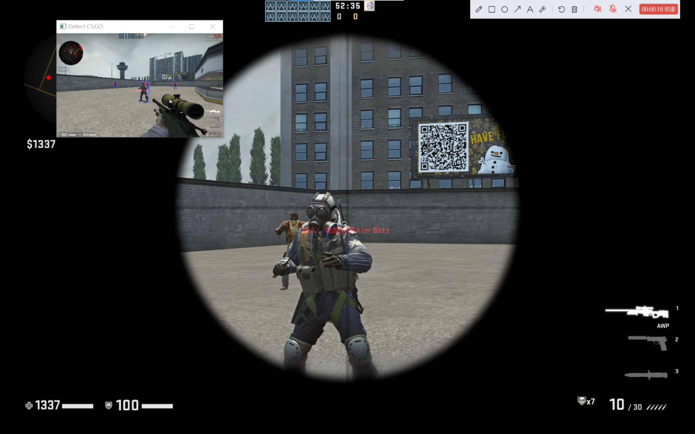
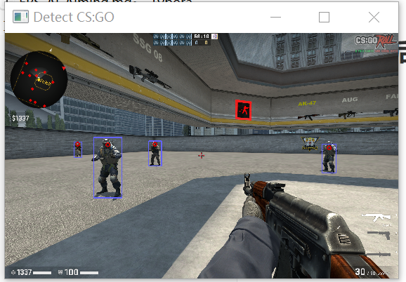

# FPS-AI-Aiming :dart:

组员：（打码）

## 概要 

**本程序为SJTU AI001课程小组作业，仅供技术验证，不用于实际游戏作弊**

​	本程序基于pytorch框架与yolov5物体检测平台，实现了人工智能对FPS（第一人称射击）游戏的辅助瞄准。与传统游戏作弊方式不同，本程序不读取或改动游戏的内存数据，而是通过人工智能实时分析游戏画面、确定敌人位置并移动鼠标射击，反应流程与人脑相同，难以被普通反作弊方式检测。本程序的特点有：

* 单次识别过程经过反复优化，在RTX30系显卡下单次时延$\leq 0.1s$​
* 前后端分离，前端启动器UI界面现代化、扁平化，提供参数调节功能并与后端通过json参数共享
* 设计演示模式，实时展现AI的识别过程
* 设计静态和动态模式，在敌人静态和近匀速运动时有可观的射击精准度
* 适配多款射击游戏，对CS:GO（《反恐精英:全球攻势》）单独优化，考虑到鼠标加速与鼠标灵敏度设置对程序参数的影响

​	从本次技术验证中，我们深刻意识到游戏公司对以人工智能CV识别为原理的新型游戏作弊方式防不胜防，但AI为缩小延迟，一般将移动鼠标的过程尽量缩短，且模拟鼠标移动方式与人工存在差异。通过实时记录鼠标移动、结合用户举报，未来或许可以训练出合适的神经网络检测这一新型游戏作弊方式。同时，我们也意识到此类技术或许可以运用于未来战场。

## 目录

[TOC]


## 程序架构

程序中由组员原创的主要代码文件有：

* `launcher.py` 前端启动器，与用户提供交互。用户可设置启动参数并运行
* `\bin\ai.py` 后端主程序，捕捉游戏画面、调用API识别人物、计算射击位置并模拟移动鼠标
* `\bin\demo.py` 演示模式前台置顶小窗，展示识别过程
* `\bin\asr_switch.py` 用于语音识别关闭后端（待进一步测试）

程序开发过程中用于测试性能和参数的代码文件有：

* `\bin\tune.py` 用于测试CS:GO（《反恐精英:全球攻势》）鼠标加速与鼠标灵敏度设置对程序参数的影响

使用的第三方模型平台有：

* `\bin\ultralytics\yolov5\`  调用的物体检测平台，基于torch
* `[Console-Running-Directory]\yolov5n.pt`  预训练模型位于运行脚本的命令行cd目录（若无则自动下载）

* `\bin\audio.py` 课程提供库（来自`sjtu.audio`）

## 功能实现与技术方案

程序运行流程图如下：

注：需使用`launcher.py`启动程序，若直接启动`\bin\ai.py`会自动关闭。



### 前端启动器

* 前端界面中的各组件使用均基于 `tkinter` 的 `ttkbootstrap` 库构建。

* 每行为一组参数的选择，设计上借鉴了pytorch和openVINO下载界面的风格，布局上使用多重`ttk.Frame  `嵌套 `ttk.RatioButton` 实现。同时，根据不同的参数选择会提供不同的提示（如模型选择较小的`yolov5n`，显示“所有设备均推荐使用”，选择较深层的`yolov5m`，显示“推荐在RTX3080及以上显卡使用）。

* 选择目标游戏为CS:GO时会显示鼠标灵敏度的调节条（使用 `ttk.Scale` 实现），运行后参数被保存至 `\\bin\running_status.json` 中，可供下次启动时自动读取，省去了每次设置的麻烦。同时使用 `try...except` 语句避免第一次运行json文件不存在引发报错。

* 点击运行按钮后，弹窗提示使用说明。并根据参数执行 `\bin\ai.py` 和 `\bin\demo.py` ，运行按钮同时变为关闭按钮，用于关闭后端脚本。运行状态下，窗口标题也发生改变。

  
  
  

### 后端脚本

* 从 `\\bin\running_status.json` 读取启动器中用户定义的参数

* 使用 `win32gui`、`screenindo`、`PyQt5`库实现自动获取系统原始分辨率与对指定游戏窗口的截屏，并定义了`QImageToCvMat()`函数将捕捉到的屏幕截图转换格式。在 `demo` 模式下使用`opencv`库相关函数绘制人物位置、头部位置并弹窗展示。

* 使用`keyboard`库的`keyboard.hook()`函数对键盘事件实施监听，当用户按下`x`键时启动后续流程

* 通过 `torch.hub.load()` 函数调用 `yolov5` 库的API捕捉人物位置，选取置信度较高、离准星最近的识别目标，通过 `calc_head()` 计算头部位置。运动模式下单次按下`x`重复上述流程两次，计算敌方运动速度、根据实测的识别时间加以运动补偿。

* 定位到射击位置后使用 `pydirectinput.moveTo()` 与  `pydirectinput.click()` 函数移动鼠标并模拟射击。对CS:GO采取特殊优化，通过前端传入的鼠标灵敏度计算移动速度的倍率`tune`

  



## 技术难点

### 1.Python的tkinter标准GUI库设计风格老旧

解决：使用`ttkbootstrap`库实现了美化。

### 2.前后端传递参数问题

通过`import`调用函数的方式难以调和前后端多个循环执行的`loop`冲突与阻塞

解决：**前后端完全分离**，前端通过`start pythonw`  以独立进程、隐藏终端的方式打开后端脚本，通过json文件传递、保存参数并关闭后端脚本。

### 3.单次瞄准时间延迟高

最早版本的单次瞄准需要花费0.4-0.5秒，这么高的延迟在紧张的射击游戏中毫无作用，应对移动敌人精准度差。最后我们将速度优化至在RTX30系显卡（RTX3070 6M）下单次时延约0.09秒，在集成显卡（AMD R7-5800H 移动端Vega Graphics）下单次时延小于0.2秒）

解决：我们对从截图、识别到模拟鼠标移动的**多个环节都进行了反复的迭代优化**

* 测试5种截图方式，最终选择了最快的`PyQt5`库函数，截屏部分最终耗时小于0.02秒。
* 测试多种模型，最终选择 `yolov5n` 和 `yolov5s` 模型作为主力（用户可以在启动器选择），并将模型从 `cpu-only` 迁移至 `cuda`（GPU），识别模型部分最终耗时小于0.06秒（`yolov5n` ，独显）、0.12秒（`yolov5n` ，核显）
* 研究 `pydirectinput` 的库函数代码，保证性能的情况下进行改动，使鼠标移动部分耗时小于0.005秒，几乎忽略不计。
* 多次优化了计算最佳射击位置的函数`aim()`和`calc_head()`，确立目标部分耗时最终小于0.008秒，几乎忽略不计。

### 4.预训练模型仅提供人物矩形框

考虑到实时游戏下的性能影响和速度需求，使用的模型仅提供人物识别的矩形框

解决：**自行设计了通过矩形框计算人物头部位置的函数**，确定头部大致位置并瞄准。根据游戏运行时实际情况调整，最终射击精确度十分可观

### 5.CS:GO鼠标偏移问题

CS:GO接受鼠标原始输入后进行了变换，导致鼠标移动过大时出现偏移。

解决：在反复测试中我们确定其与鼠标加速、鼠标灵敏度有关。我们记录了约20组参数，**自行搭建了单层pytorch全连接模型**，最终回归得到了鼠标移动倍率基本与鼠标灵敏度和鼠标加速有关，并得到定性关系。同时在游戏内关闭“原始输入”选项。


## 开发日志

### 前端启动器

#### 0.3.6 - 7-16-10:08

* 修复了2个bug
* 优化使用体验，在运行时改变参数，将提示用户改动下次生效，若在启动器内使用快捷键启动/关闭后端将不显示弹窗
* 在游戏内可以通过语音关闭后端，无需切换启动器关闭（待进一步测试）

#### 0.3.5 - 7-14-19:54

* 在用户选择CS:GO时显示鼠标灵敏度的调节器，与游戏内保持一致，提高精准度

#### 0.3.3 - 7-14-15:37

* 优化使用体验，设置弹窗提示，指引用户使用方式

#### 0.3.1 - 7-14-14:30

* 完成与后端的json参数传递
* 后端脚本改为新线程隐藏式启动（`python`->`start pythonw`），避免运行后端之后前端程序阻塞
* 增加动态模式启动（Beta）选项
* 启动器运行后端之后不再关闭，运行按钮变为结束后端。同时，关闭启动器窗口也会结束后端（类似腾讯会议设计）

#### 0.3.0 - 7-13-22:51

* 使用`ttkbootstrap`重构界面，现代化、扁平化。
* 增加模型选择及提示、游戏选择、启动方式选择（Demo或Normal）

#### 0.2.0 - 7-13-11:23

* 使用`tkinter`完成前端启动器开发

### 后端脚本

#### 0.3.3 - 7.15-19:32

* 修复了演示模式的1个bug，优化动态补偿算法的流程，减少时延

#### 0.3.2 - 7.14-23:11

* 适配CS:GO，根据用户输入的鼠标灵敏度调整鼠标移动算法，提高精准度

#### 0.3.1 - 7.14-18:00

* 新的演示模式，实时标框并展示，截图识别范围改回全屏识别。
* 完成与前端的json参数传递

#### 0.3.0 - 7.14-00:56

* 修复识别非真实屏幕分辨率的问题
* 初步实现了动态补偿算法，对近匀速运动的敌人有效

#### 0.2.0 - 7.13-12:32

* 将模型迁移至cuda，进一步降低时延
* 优化了选择最佳目标的方式，由选择最大目标改为选择离准星最近目标

#### 0.1.5 - 7.12-21:48

* 改进截图、鼠标移动的API，修改使用模型，简洁流程函数。降低单次瞄准延迟为0.2秒左右，与高手反应速度持平
* 修改截图的识别位置为屏幕中心
* 使用opencv置顶小窗展示识别过程

#### 0.1.0 - 7.12-11:14

* 初代版本，单次瞄准延迟近0.4-0.5秒


## 附录

### 第三方依赖库

```
os
sys
time
tkinter
ttkbootstrap
json
pickle
PyQt5.QtWidgets
PyQt5.QtGui
win32gui
pytest
pytorch(torch)
keyboard
pydirectinput
opencv-python(cv2)
numpy
```


